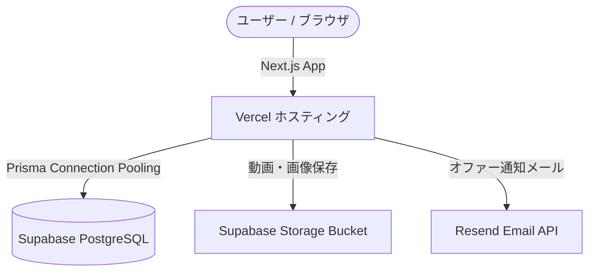

# JobSwipe (ジョブスワイプ) - プロジェクト共有・開発引き継ぎドキュメント

開発協力者向けのシステム概要、本番URL、ソースコードリポジトリ、デモ用アカウント、外部連携サービス、環境構築手順をまとめたドキュメントです。

---

## 1. プロジェクト基本情報

| 項目 | 内容 |
| :--- | :--- |
| **サービス名** | **JobSwipe (ジョブスワイプ)** |
| **コンセプト** | 「短尺自己PR動画で人柄を可視化する新卒逆求人プラットフォーム」 |
| **本番公開URL** | [https://jobswipe-app.vercel.app](https://jobswipe-app.vercel.app) |
| **ソースコード (GitHub)** | [https://github.com/nanato0102/jobswipe](https://github.com/nanato0102/jobswipe) (ブランチ: `main`) |
| **主要ターゲット** | 学生・求職者（26卒・27卒等）、新卒採用を実施する企業の人事担当者 |

---

## 2. サンプル・デモ用アカウント（ID / PASS）

ローカル環境および本番環境で動作確認・検証を行うための初期アカウント一覧です。

> **※全アカウント共通初期パスワード:** `password123`

### ① 学生アカウント (STUDENT)
| 氏名 | ログインID (Email) | パスワード | 特徴・プロフィール概要 |
| :--- | :--- | :--- | :--- |
| **佐藤 健太** | `sato@example.com` | `password123` | 早稲田大学 商学部 / 体育会サッカー部主将 / 営業志望 / PR動画登録済 |
| **高橋 美咲** | `takahashi@example.com` | `password123` | 上智大学 外国語学部 / カナダ留学経験・TOEIC 920点 / マーケ・広報志望 / PR動画登録済 |

### ② 企業アカウント (COMPANY)
| 企業名 | ログインID (Email) | パスワード | 担当者機能 |
| :--- | :--- | :--- | :--- |
| **テックイノベーション株式会社** | `hr@tech-innovations.jp` | `password123` | IT・Webサービス / スワイプ閲覧、気になるリスト、オファー送信、チャット機能 |

### ③ 管理者アカウント (ADMIN)
| ロール | ログインID (Email) | パスワード | 管理機能 |
| :--- | :--- | :--- | :--- |
| **システム管理者** | `admin@jobswipe.jp` | `password123` | 管理者ダッシュボード（KPI分析、登録企業・学生承認・管理） |

---

## 3. 技術スタック & アーキテクチャ

| レイヤー | 採用技術 | 備考 |
| :--- | :--- | :--- |
| **フロントエンド** | **Next.js 16.3 (App Router)**, React 19, TypeScript | Strictモード準拠 |
| **スタイリング** | **Tailwind CSS**, Lucide React (アイコン) | グラデーション・絵文字不使用のクリーンデザイン |
| **バックエンド / API** | **Next.js Route Handlers (API Routes)** | `src/app/api/*` |
| **データベース / ORM** | **PostgreSQL (Supabase)**, **Prisma ORM** | Prisma Client v5.22 |
| **認証 (Auth)** | **Next-Auth / Session Cookie (JWT)** | パスワードは bcrypt で暗号化 |
| **ホスティング** | **Vercel** (Production) | CI/CD自動デプロイ |

---

## 4. 連携外部サービス一覧



### ① Vercel (Webホスティング & サーバーレス)
- **役割:** Next.js アプリケーションのビルド・デプロイ・エッジ配信
- **プロジェクト名:** `jobswipe-app`

### ② Supabase (データベース & ストレージ)
- **リージョン:** 東京 (`ap-northeast-1`)
- **PostgreSQL Database:** Prisma経由で接続（PgBouncerコネクションプール: ポート `6543`、ダイレクト接続: ポート `5432`）
- **Storage:** 学生の自己PR動画および企業ロゴ等のメディア保存用

### ③ Resend (メール配信 API)
- **役割:** 企業からのオファー送信時、管理者への通知等のトランザクションメール配信
- **通知先設定:** `ADMIN_NOTIFICATION_EMAIL` (`jobswipe.info@gmail.com`)

---

## 5. 環境変数 (`.env` 仕様)

ローカル開発およびVercelのEnvironment Variablesに設定されている変数一覧です。

```bash
# データベース接続 (Supabase Connection Pooling)
DATABASE_URL="postgresql://postgres.<PROJECT-REF>:<PASSWORD>@aws-0-ap-northeast-1.pooler.supabase.com:6543/postgres?pgbouncer=true"

# データベース直接接続 (Prisma Migrate用)
DIRECT_URL="postgresql://postgres.<PROJECT-REF>:<PASSWORD>@aws-0-ap-northeast-1.pooler.supabase.com:5432/postgres"

# 認証シークレットキー & URL
AUTH_SECRET="your-auth-secret-key"
NEXTAUTH_URL="http://localhost:3000"

# Resend メール配信API
RESEND_API_KEY="re_xxxxxxxxxxxx"
ADMIN_NOTIFICATION_EMAIL="jobswipe.info@gmail.com"

# Supabase Storage 連携
NEXT_PUBLIC_SUPABASE_URL="https://fjxcrmmsfcbwvfvbavtt.supabase.co"
NEXT_PUBLIC_SUPABASE_ANON_KEY="your-supabase-anon-key"
SUPABASE_SERVICE_ROLE_KEY="your-supabase-service-role-key"
```

---

## 6. ローカル開発環境のセットアップ手順

### 1. リポジトリのクローン
```bash
git clone https://github.com/nanato0102/jobswipe.git
cd jobswipe
```

### 2. パッケージのインストール
```bash
npm install
```

### 3. 環境変数ファイルの作成
プロジェクト直下に `.env` ファイルを作成し、上記「5. 環境変数」の内容を記述します。

### 4. Prisma クライアントの生成 & シードデータの反映
```bash
# Prisma Client 生成
npx prisma generate

# 初期データ（サンプルアカウント・動画データ）の投入
node prisma/seed.js
```

### 5. 開発サーバーの起動
```bash
npm run dev
```
ブラウザで [http://localhost:3000](http://localhost:3000) を開いて動作を確認します。

---

## 7. 主要ディレクトリ構成

```text
├── prisma/
│   ├── schema.prisma        # DBスキーマ定義
│   └── seed.js              # 初期シードデータスクリプト
├── public/                  # ロゴ・アイコン等の静的アセット
├── src/
│   ├── app/                 # Next.js App Router
│   │   ├── (auth)/          # ログイン・会員登録ルート
│   │   ├── admin-console/   # 管理者ダッシュボード
│   │   ├── company/         # 企業向け機能（スワイプ、チャット、オファー）
│   │   ├── student/         # 学生向け機能（マイページ、動画投稿、オファー一覧）
│   │   ├── for-company/     # 企業向けLP
│   │   ├── api/             # バックエンドAPIルート
│   │   └── page.tsx         # 学生向けトップLP
│   ├── components/          # 共通UIコンポーネント
│   └── lib/                 # Prismaクライアント、認証・通知ユーティリティ
└── package.json
```
